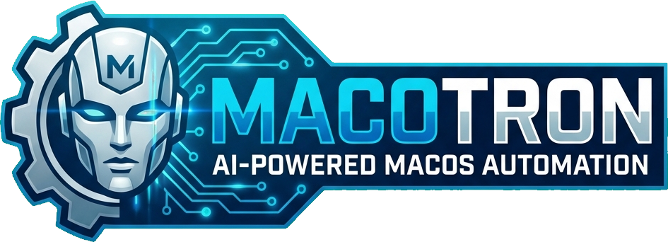

<p align="center">
  
</p>

AI-powered macOS automation. Describe what you want in plain English — Macotron's coding agent writes the scripts, tests them, and gets out of your way.

Replaces Raycast, Hammerspoon, Rectangle, Velja, OverSight, xbar, and similar tools with a single scriptable app.

## How It Works

You type a command like *"set up keybindings to tile my windows"*. The agent plans, writes JavaScript snippets, hot-reloads the engine, validates the scripts, and auto-repairs if anything breaks. You never see code unless you want to.

```
User: "set up keybindings to tile my windows"
  |
  v
Agent: plans -> writes 001-window-tiling.js -> reloads engine -> tests -> done
  |
  v
Result: Ctrl+Opt+Left/Right/Enter now tile windows
```

## Architecture

```
+----------------------------------------------------------+
|                      Macotron.app                         |
|                                                          |
|  +------------------+  +--------------------------+      |
|  | Menu Bar         |  | Floating Prompt Panel    |      |
|  | (always on)      |  | (toggle via hotkey)      |      |
|  +------------------+  +--------------------------+      |
|                                                          |
|  +----------------------------+  +--------------------+  |
|  |     Agent Loop             |  | Progress Panel     |  |
|  |  Plan -> Write -> Test     |  | (floating, bottom  |  |
|  |  -> Repair -> Done         |  |  right, auto-hide) |  |
|  +----------------------------+  +--------------------+  |
|                                                          |
|  +----------------------------------------------------+  |
|  |              MacotronEngine                         |  |
|  |  +----------+ +----------+ +--------------------+  |  |
|  |  | QuickJS  | | EventBus | | SnippetManager     |  |  |
|  |  | Runtime  | |          | | (load/watch/backup) |  |  |
|  |  +----------+ +----------+ +--------------------+  |  |
|  |                                                     |  |
|  |  +-----------------------------------------------+  |  |
|  |  |            Native Modules (20)                 |  |  |
|  |  |  window  | keyboard | screen  | shell          |  |  |
|  |  |  notify  | camera   | fs      | clipboard      |  |  |
|  |  |  app     | system   | http    | menubar        |  |  |
|  |  |  display | timer    | usb     | url            |  |  |
|  |  |  spotlight | keychain | localStorage | ai      |  |  |
|  |  +-----------------------------------------------+  |  |
|  +----------------------------------------------------+  |
|                                                          |
|  +----------------------------------------------------+  |
|  |                AI Layer                              |  |
|  |  AgentSession | ClaudeProvider | SnippetAutoFix     |  |
|  |  AIToolCall   | AISystemPrompt | CapabilityReview   |  |
|  +----------------------------------------------------+  |
+----------------------------------------------------------+
```

### The Layer Cake

| Layer | What it does |
|---|---|
| **User** | Types a natural language command in the prompt panel |
| **Agent** | Plans steps, writes `.js` files via tool calls, validates, repairs |
| **JS Engine** | QuickJS executes snippets: `macotron.keyboard.on("ctrl+opt+left", ...)` |
| **Native Bridge** | Swift modules expose macOS APIs: AXUIElement, CGEventTap, ScreenCaptureKit, ... |
| **macOS** | Windows move, events fire, notifications show |

### Source Targets

| Target | Purpose |
|---|---|
| `CQuickJS` | Vendored quickjs-ng C library |
| `MacotronEngine` | QuickJS Engine, EventBus, SnippetManager, CapabilityReview |
| `MacotronUI` | LauncherPanel, SettingsWindow, WizardWindow, AgentProgressPanel |
| `Modules` | 20 native modules (window, keyboard, shell, screen, etc.) |
| `AI` | ClaudeProvider, AgentSession, SnippetAutoFix, tool definitions |
| `Macotron` | AppDelegate, module registration, wiring |

## Building

Requires **macOS 15 Sequoia** and **Swift 6.0+**. No Xcode GUI needed.

```bash
make build    # compile
make run      # compile + bundle + launch
make dev      # compile + bundle + run with debug server on :7777
make clean    # clean build artifacts
```

## Code Signing & Permissions

Macotron uses CGEvent taps and Accessibility APIs that require macOS permissions. These permissions are tied to the app's code signature, so signing matters.

### Ad-hoc signing (default)

By default, `make run` signs the app ad-hoc (`codesign --sign -`). This works but generates a new cdhash every build, which **resets your macOS permissions each time**. You'll need to re-grant Accessibility after every rebuild.

### Stable signing with a self-signed certificate (recommended)

Create a local code-signing certificate so permissions persist across rebuilds:

```bash
# Generate cert + key, bundle into p12, import to keychain (one-time setup)
openssl req -x509 -newkey rsa:2048 -keyout /tmp/mc.key -out /tmp/mc.crt \
  -days 3650 -nodes -subj "/CN=Macotron-Dev" \
  -addext "extendedKeyUsage=codeSigning" && \
openssl pkcs12 -export -out /tmp/mc.p12 -inkey /tmp/mc.key -in /tmp/mc.crt \
  -passout pass:temp -legacy && \
security import /tmp/mc.p12 -k ~/Library/Keychains/login.keychain-db \
  -P temp -T /usr/bin/codesign && \
rm /tmp/mc.key /tmp/mc.crt /tmp/mc.p12
```

Then build with the certificate:

```bash
make run SIGN_IDENTITY=Macotron-Dev

# Or export it so you don't have to pass it every time:
export SIGN_IDENTITY=Macotron-Dev
make run
```

### Granting permissions

Macotron needs **Accessibility** permission for global hotkeys. After the first build with a stable certificate:

1. Open **System Settings → Privacy & Security → Accessibility**
2. Click **+** and add `~/Applications/Macotron.app`
3. Enable the toggle

If hotkeys stop working after a rebuild, the TCC database may have a stale entry from a previous ad-hoc build. Fix it by removing and re-adding Macotron in the Accessibility list, or reset all Accessibility entries:

```bash
tccutil reset Accessibility
```

### Verifying the signature

```bash
codesign -d -vvvv ~/Applications/Macotron.app
# Look for: Authority=Macotron-Dev (not "adhoc" or "unknown certificate")
```

## Development

### Dev Config Shortcut

Create `~/.macotron-dev.json` to skip the first-run wizard's API key step:

```json
{
  "apiKey": "sk-ant-...",
  "provider": "claude",
  "model": "claude-sonnet-4-20250514"
}
```

The wizard will auto-fill the provider and API key from this file. It's gitignored and never shipped.

### Reset to First-Run State

```bash
make cleanprefs   # wipes UserDefaults + config dir, triggers wizard on next launch
```

### Debug HTTP Server

Run with `make dev` to start the debug server on port 7777:

| Endpoint | Method | Description |
|---|---|---|
| `/screenshot` | GET | PNG of launcher panel |
| `/snapshot` | GET | Accessibility tree as JSON |
| `/eval` | POST | Evaluate JS in engine |
| `/reload` | POST | Trigger snippet reload |
| `/snippets` | GET | List loaded snippets |
| `/open` | POST | Toggle launcher panel |

### Config Directory

All user data lives in `~/Library/Application Support/Macotron/`:

```
~/Library/Application Support/Macotron/
  config.js         # Main config (hotkey, module options)
  snippets/         # Automation scripts (executed alphabetically)
  commands/         # Named commands (appear in launcher)
  data/             # Persistent state (localStorage.json)
  backups/          # Auto-created before every AI change
```

## Tech Stack

| Component | Technology |
|---|---|
| Language | Swift 6.0 (strict concurrency) |
| UI | SwiftUI + NSPanel |
| JS Runtime | [quickjs-ng](https://github.com/quickjs-ng/quickjs) (embedded, ~400KB) |
| AI | Anthropic Claude API (OpenAI also supported) |
| Package Manager | Swift Package Manager |
| Distribution | Direct download + Homebrew (not sandboxed) |

## Documentation

See the `docs/` directory for detailed architecture docs:

- [01 - Overview](docs/01-overview.md)
- [02 - Project Structure](docs/02-project-structure.md)
- [03 - Engine Design](docs/03-engine.md)
- [04 - Native Modules](docs/04-modules.md)
- [05 - AI Integration](docs/05-ai-integration.md)
- [06 - Security](docs/06-security.md)
- [07 - Build System](docs/07-build-system.md)
- [08 - Examples](docs/08-examples.md)
