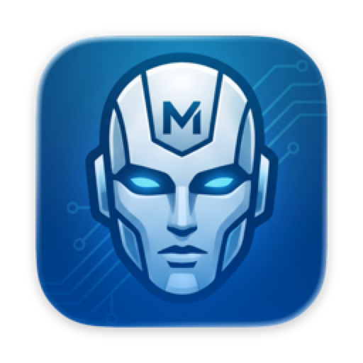

<p align="center">
  
</p>

<h1 align="center">Macotron</h1>
<p align="center"><b>It does everything.</b><br>Customization and automation with a quick launch bar, global hotkeys, menu bar items, and APIs for everything you can think of. Open-source and free.</p>

<p align="center">
  <a href="#install">Install</a> ·
  <a href="#quickstart">Quickstart</a> ·
  <a href="#what-it-does">What it Does</a> ·
  <a href="#plugins">Plugins</a> ·
  <a href="#security">Security</a> ·
  <a href="https://macotron.statico.io">Home Page</a>
</p>

---

## Install

Pick one:

- [Download for macOS](https://github.com/statico/macotron/releases/latest)
- `brew install statico/tap/macotron`

Either way, Macotron updates itself after that. It checks daily and asks before installing anything; **Check for Updates...** in the menu checks right now, and Settings > General turns the automatic check off.

## Quickstart

1. Download, install, and open Macotron
1. Pick a directory to store your settings and plugins
1. Add any example plugins that look interesting
1. Approve any permissions requests
1. Hit ⌥-Space (the default) and explore the quick search items
1. Explore the new menu bar items
1. Explore the Macotron settings
1. Open the plugins directory with your favorite AI coding agent and have fun!

## What it Does

The default plugins do things like:

- Extend quick search with files, contacts, or Apple Notes
- Toggle extra-dark or red night vision mode
- Control your Apple TV
- Put CPU, GPU, and memory meters in the menu bar
- Show upcoming meetings and alert you when they start
- Organize windows by halves, thirds, or by snapping edges & corners
- Clipboard history, text snippets, text replacement
- Open certain URLs in certain browsers
- Control your fan speed
- Convert HEIC images to JPEGs in `~/Downloads`
- Toggle mic mute or cycle through audio output devices
- Show the now-playing music information with album art
- Start a chat window with Apple Intelligence
- Select a region on the screen and OCR it
- Show Time Machine backup time remaining

...but that's not all. Check [the home page](https://macotron.statico.io) for a longer list of examples.

## Plugins

Each bit of Macotron functionality is contained in a **plugin**. A plugin is a single JavaScript file that defines metadata, permissions required, settings that the user can override, and all of the hooks and logic needed for it to run.

**The intention is to let AI coding agents make plugins for you.** The plugins directory will contain an `AGENTS.md` with all of the information your agent needs.

**Plugins must be reloaded once changed,** at least by default. When developing plugins, you can choose **Enable Hot Reloading** in the Macotron menu to automatically reload them without confirmation.

### Example Plugin

```javascript
macotron.plugin({
  title: "Move Windows",
  description: "Tile windows using hotkeys",
});

macotron.keyboard.on("Tile Left", "ctrl+opt+left", () => {
  const win = macotron.window.focused();
  macotron.window.moveToFraction(win.id, {
    x: 0, y: 0, w: 0.5, h: 1,
  });
});

// ...
```

If you have Hot Reloading turned on, changing the plugin source will take effect instantly.

You can read [a concise description of the API](https://macotron.statico.io/#api), the [full API reference](https://github.com/statico/macotron/blob/main/Sources/Macotron/Resources/macotron.d.ts), or [browse the default plugins](https://github.com/statico/macotron/blob/main/Examples/plugins/README.md). Or just, y'know, let your agent do that for you or whatever.

### Sharing Plugins

**Settings → Plugins → Catalog → Community** lists every GitHub repo tagged [`macotron-plugin`](https://github.com/topics/macotron-plugin). To get yours in there:

1. Name the repo `macotron-plugin-<name>`. One plugin per repo, one `.js` file in the root, called `<name>.js`.
2. Add the `macotron-plugin` topic.

That's the whole process. There's no index to update, no PR to file, and no review queue to wait on. [macotron-plugin-cleanshot](https://github.com/statico/macotron-plugin-cleanshot) is a working example.

Nothing installs or updates itself. Macotron downloads the source, scans it, shows you who wrote it, and waits for you to say yes.

## Security

Hotkeys and window control need Accessibility and Input Monitoring. Screen capture needs Screen Recording. Fan control needs a system helper app installed. It's a little scary, but Macotron tries to only ask for additional permissions when an enabled plugin needs them.

By default, plugins are not reloaded if the source changes. This is to prevent a malicious app from running arbitrary code. You'll need to approve all plugin changes, or you can turn on Hot Reloading in the menu bar to automatically reload plugins when developing them.

Shell commands require approval the first time they're run.

Plugins can define secrets that are stored in the Keychain instead of on disk.

Updates are signed. Macotron only installs one that verifies against the key inside the copy you already have, so a hijacked download can't replace it.

## Contributing

Due to the hopelessness of reviewing code contributions in the AI era, pull requests have been disabled. Instead, file an issue to report a bug or request a feature.

The intent behind default plugins isn't to offer every plugin imaginable, but rather a set just big enough to show off Macotron's capabilities and provide great default behavior.

### Building

If you do want to build Macotron locally, you'll need macOS 15 Sequoia and Swift 6.2 or later. No Xcode GUI is required.

```bash
make build    # compile, app lands in ~/Applications/Macotron.app
make run      # compile, bundle, launch
make clean    # build artifacts
```

For more information, refer to the plans and documentation in `docs/`.

## License

Macotron is MIT licensed. See [LICENSE](LICENSE).

### Third-party code

| Component | Location | License |
|---|---|---|
| [QuickJS-ng](https://github.com/quickjs-ng/quickjs), the JavaScript engine | `Vendor/quickjs-ng/` | MIT |
| [Sparkle](https://sparkle-project.org), the self-update framework | Swift package, embedded in the app bundle | MIT |

QuickJS-ng is the only vendored dependency. It ships here as an amalgamated `quickjs-amalgam.c` plus headers, with the upstream copyright notices intact in the source: Fabrice Bellard, Charlie Gordon, Ben Noordhuis, Saúl Ibarra Corretgé, and Marcin Kolny. The vendored version is whatever `QJS_VERSION_*` in `Vendor/quickjs-ng/include/quickjs.h` says. `quickjs-swift-helpers.c` is Macotron's own shim, not upstream code.

Everything else is first-party Swift or an Apple-shipped framework. Sparkle is the only Swift package dependency. No npm, no Homebrew.

### AI Disclaimer

Macotron was developed with various AI coding agents and models, partially as a research project for me to test various models. I haven't looked at much of the code in detail, but I've had many models perform many reviews, and the codebase feels decent enough. I've put significant effort into making the API concise, the UX decent, and performance reasonable.
