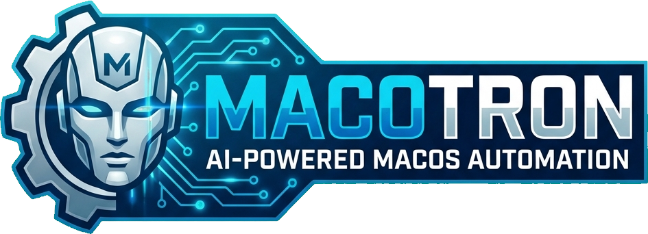

# Macotron

<p align="center">
  
</p>

Early, incomplete, and fun to poke at.

Macotron is a native macOS host for JavaScript plugins — a thin app that lets a `.js` file drive the Mac. You pick a plugins folder. Cursor, Claude Code, or you write the files. Macotron loads them, hot-reloads on save, and bridges them to real macOS APIs.

No in-app coding agent. The plugins on disk are the source of truth.

## What it can do

- Quick launcher for apps and commands
- Fuzzy search as you type
- Extra launcher rows from plugins (Notes and the like); star items with ⌘S to pin them on open
- Per-command keyboard shortcuts
- Global hotkeys, changeable in Settings
- Tile windows to halves, corners, and other displays
- Drag a window to an edge to snap it
- Switch between open windows
- Extra menu bar items (icons, two-line text, click menus)
- System notifications
- On-screen toasts
- Small HTML panels, including Liquid Glass
- Screenshot the display or a dragged selection
- Magnifier color picker
- OCR on images and screenshots
- Spotlight file search from a plugin
- Clipboard get/set, images, and history
- Text snippets with abbreviation expansion
- Now Playing: artwork, play/pause, next/previous
- Keep the Mac awake
- Wi-Fi SSID and interface IPs
- Idle time
- CPU, GPU, memory, battery, disk, and process stats
- CPU temperature
- Fan RPM and a minimum fan floor
- Display brightness, XDR, gamma, identity, and `display:changed`
- Post clicks, keys, Unicode, and scroll; tap HID (including Option-hold / `flagsChanged`)
- List, launch, switch, hide, and quit apps
- Choose an app menu item
- React when an app launches, quits, or comes forward
- Switch default audio input and output; volume and mute
- List Mission Control spaces and switch desktops
- USB attach and detach
- Talk to HID devices (list, feature/output/input reports)
- Run Shortcuts.app shortcuts
- Lock, sleep, display sleep, screensaver, log out, restart, and shut down; hear sleep, wake, and lock
- Minimize, close, or fullscreen a window
- React when a window is created or focused
- Upcoming Calendar events
- List and open Apple Notes
- Custom URL schemes
- Open a link in a chosen browser or profile
- HTTP from plugins
- Read, write, list, and watch files
- Run Apple-shipped shell tools (`open`, `defaults`, `osascript`, …)
- Keychain storage for API keys
- Plugin options in Settings (text, toggles, dropdowns, passwords, files)
- Plugin checks in Settings, with an orange warning when something is blocked
- Chat with on-device Apple Intelligence
- Chat with Claude, Gemini, or OpenAI
- Stream model tokens into a panel
- Hot-reload when a plugin file changes
- One plugins folder, optionally a git repo
- Stock Mac only — no Homebrew, npm, or extra apps

Try the demos in [Examples/plugins](Examples/plugins/README.md). Community plugins: [github.com/topics/macotron-plugin](https://github.com/topics/macotron-plugin).

## How it works

1. First launch: pick a plugins directory.
2. Open that folder in your editor or coding agent.
3. Add or edit `.js` files under `plugins/`.
4. Macotron reloads them.

```
plugins/*.js  →  QuickJS + native modules  →  macOS
```

Plugins call `macotron.window`, `macotron.menubar`, `macotron.ai`, and friends. Details: [docs/04-modules.md](docs/04-modules.md) and [macotron.d.ts](Sources/Macotron/Resources/macotron.d.ts).

The workdir is a git repo the app can initialize (`settings.json`, `plugins/`, agent instruction files). Layout: [docs/10-plugins-workdir.md](docs/10-plugins-workdir.md).

## Building

**macOS 15 Sequoia** and **Swift 6.2+**. No Xcode GUI needed.

```bash
make build    # compile
make run      # compile, bundle, launch
make dev      # same, plus debug server on :7777
make clean    # build artifacts
```

The app lands at `~/Applications/Macotron.app`.

## Permissions and signing

Hotkeys and window control need Accessibility and Input Monitoring. Screen capture needs Screen Recording. The app asks when a feature needs them.

Permissions stick to the **code signature**. `make run` signs ad-hoc by default, so each rebuild can reset the toggles. For a stable signature, create a local **Macotron-Dev** code-signing certificate in Keychain Access (Certificate Assistant → Code Signing). Then:

```bash
make run   # picks Macotron-Dev if it exists
```

After the first stable-signed build, add `~/Applications/Macotron.app` under **System Settings → Privacy & Security → Accessibility** (and Input Monitoring / Screen Recording as needed).

If hotkeys die after a rebuild, remove and re-add Macotron in that list, or `tccutil reset Accessibility`.

```bash
codesign -d -vvvv ~/Applications/Macotron.app
```

Look for `Authority=Macotron-Dev`, not adhoc.

## Development

```bash
make cleanprefs   # wipe prefs, wizard on next launch
```

`make dev` starts a debug server on port 7777:

| Endpoint | Method | What |
|---|---|---|
| `/screenshot` | GET | PNG of the launcher |
| `/snapshot` | GET | Accessibility tree JSON |
| `/eval` | POST | Run JS in the engine |
| `/reload` | POST | Reload plugins |
| `/snippets` | GET | Loaded plugins |
| `/open` | POST | Toggle the launcher |

## Docs

- [Overview](docs/01-overview.md)
- [Project structure](docs/02-project-structure.md)
- [Engine](docs/03-engine.md)
- [Native modules](docs/04-modules.md)
- [AI](docs/05-ai-integration.md)
- [Security](docs/06-security.md)
- [Build](docs/07-build-system.md)
- [Demo plugins](Examples/plugins/README.md)
- [Phases](docs/09-phases.md)
- [Plugins workdir](docs/10-plugins-workdir.md)
- [Host design](docs/superpowers/specs/2026-08-17-host-shell-design.md)
